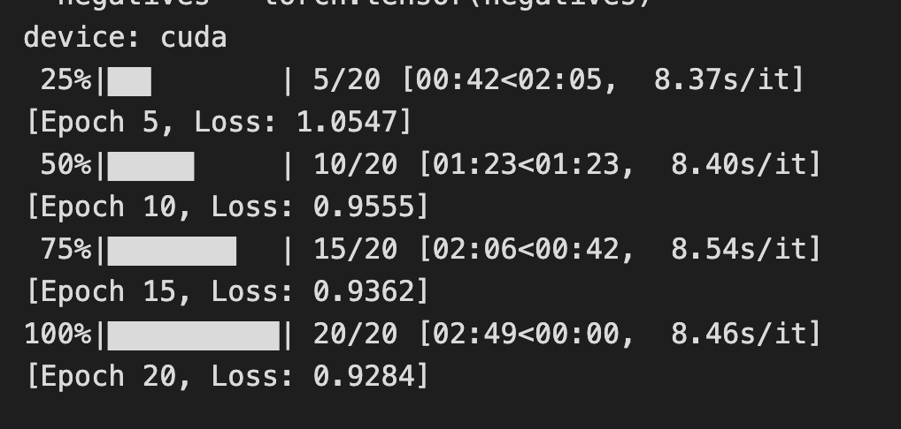
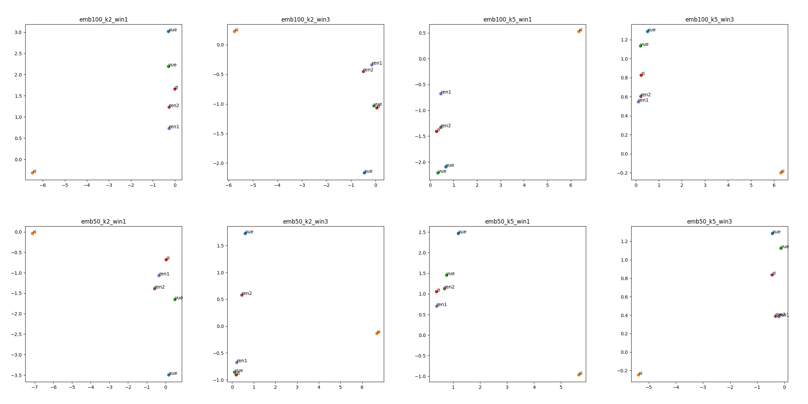
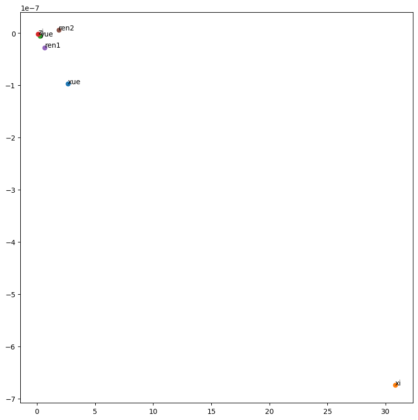

# NLP Ass2

## Name: Ziheng Wang

## SID: 12310401

## Loss and epoch

For the embedding size of 50, window size of 1, and k=2, the loss for each 5 epoch are as follows:

I choose 20 as the number of epochs, for the reason that for all the 8 cases (more loss details can be found in [notebook pdf](./A2_w2v_notebook.pdf)), when epoch is near 20, the loss would decrease in a very low speed ,around 0.01 ,which is much smaller than the loss. Meanwhile , the 20 epoch is not too large to make the 8 training times too long.

## different hyper-parameters

The 8 embeddings file are saved in ./embeddings folder.

The run time for each case is as follows:

| embedding size | window size | k   | run time   |
| -------------- | ----------- | --- | ---------- |
| 50             | 1           | 2   | 2min 53.3s |
| 50             | 1           | 5   | 2min 51.5s |
| 50             | 3           | 2   | 8min 29.6s |
| 50             | 3           | 5   | 8min 33.5s |
| 100            | 1           | 2   | 2min 47.7s |
| 100            | 1           | 5   | 2min 52.5s |
| 100            | 3           | 2   | 8min 39.1s |
| 100            | 3           | 5   | 8min 31.6s |

## 8 embeddings

The 8 plots are generated by the code in the [plot.ipynb](./plot.ipynb) file.

Pictures are saved in the ./results folder.

Comparing with the LSA in Lab4

Although the images are all different, they are basically distributed in two corners, and 'xi' is far away from other characters. It implies that in the lunyu, 'xi' may a special character, which is different from the other characters we test.
