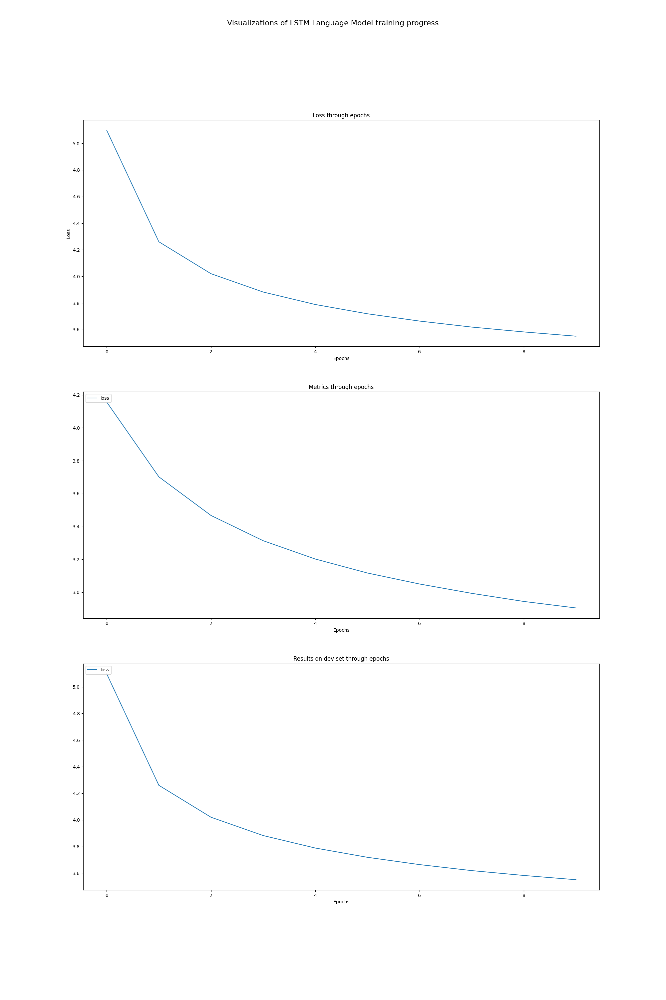

# Assignment 3

## Name: Ziheng Wang

## SID: 12310401

## Task 3

EMBEDDING_DIM = 128
HIDDEN_DIM = 256

NUM_LAYERS = 2
DROPOUT_RATE = 0.2

BATCH_SIZE = 64
SEQ_LENGTH = 50

LEARNING_RATE = 0.001
NUM_EPOCHS = 10

MIN_WORD_FREQ = 2

### perplexity scores

| Model | Perplexity |
| ----- | ---------- |
| RNN   | 32.94      |
| LSTM  | 21.38      |

### Greedy search 5 sentences pairs

Generating sentences using greedy search:

---

Prefix: 'Harry look'
RNN Generated: 'Harry look as though he had been forced to say that he was not to mention it'
LSTM Generated: 'Harry look at him and he was sure that he was not going to be able to'

---

Prefix: 'Hermione open'
RNN Generated: 'Hermione open the door of the hall and the door opened and Harry saw the sound of'
LSTM Generated: 'Hermione open the door behind him and Harry saw that the room was full of the smell'

---

Prefix: 'Ron run'
RNN Generated: 'Ron run off the castle and the castle was completely empty and silent as they were all'
LSTM Generated: 'Ron run toward the door and slammed the door shut behind him .Harry and Ron followed him'

---

Prefix: 'Magic is'
RNN Generated: 'Magic is a lot of <UNK> <UNK> <UNK> <UNK> <UNK> <UNK> <UNK> <UNK> <UNK> <UNK> <UNK> <UNK>'
LSTM Generated: 'Magic is a werewolf ! said Harry loudly as he reached the boulder closest to his ribs'

---

Prefix: 'Professor Dumbledore'
RNN Generated: 'Professor Dumbledore who was unsticking his lemon <UNK> <UNK> <UNK> <UNK> <UNK> <UNK> <UNK> <UNK> <UNK> <UNK>'
LSTM Generated: 'Professor Dumbledore and the students were all looking thunderstruck as he approached the castle .Harry was sure'

---

## Task 4

EMBEDDING_DIM = 200
HIDDEN_DIM = 256

NUM_LAYERS = 2
DROPOUT_RATE = 0.2

BATCH_SIZE = 64
SEQ_LENGTH = 50

LEARNING_RATE = 0.001
NUM_EPOCHS = 10

MIN_WORD_FREQ = 2

### Training loss

Random embedding:

Pretrained embedding:

### perplexity scores

| Model                     | Perplexity |
| ------------------------- | ---------- |
| LSTM random embedding     | 18.19      |
| LSTM pretrained embedding | 16.52      |
