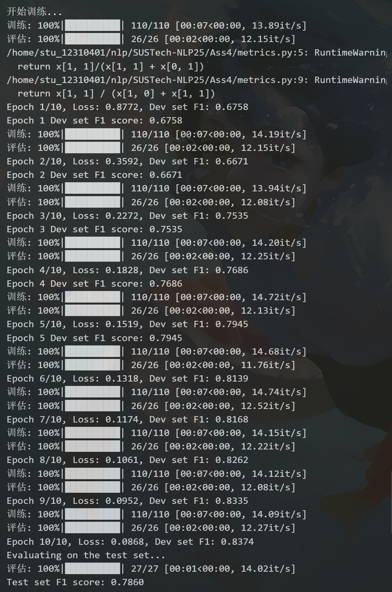
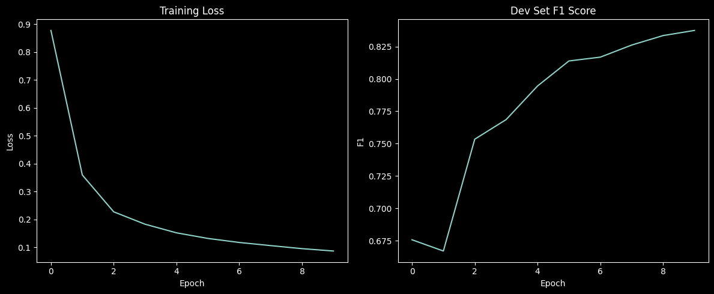
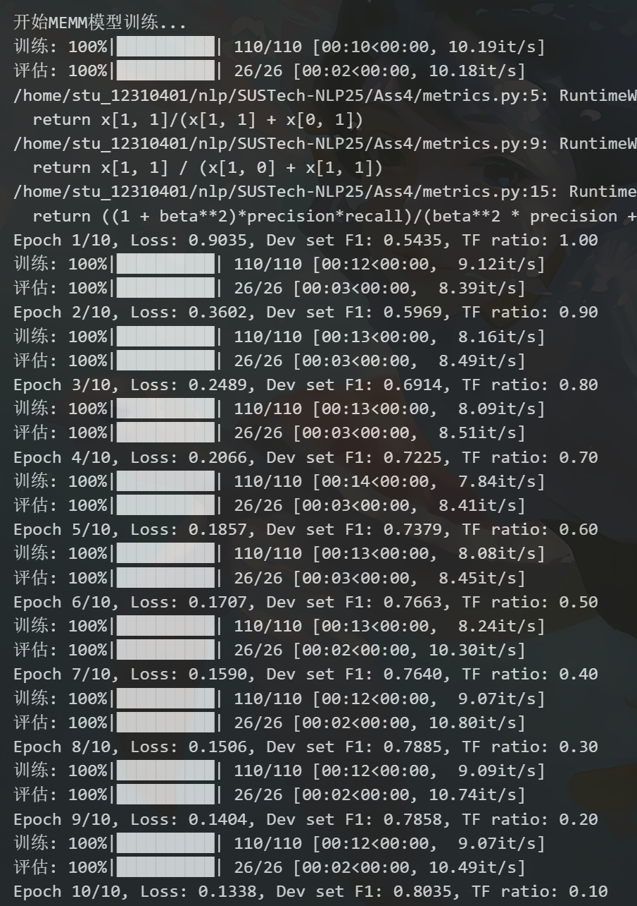
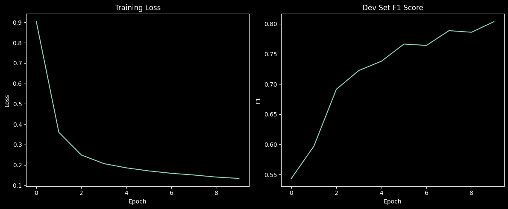
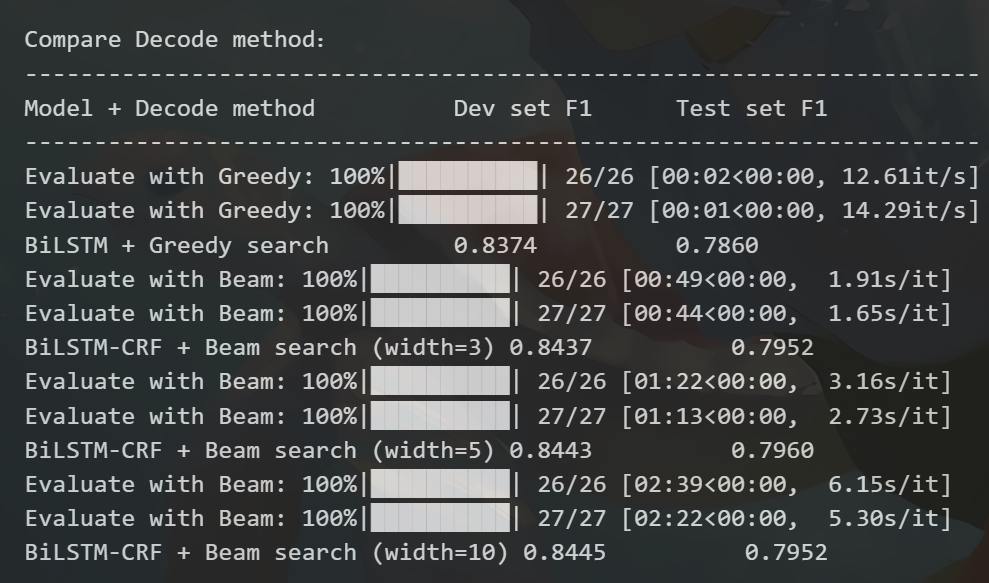
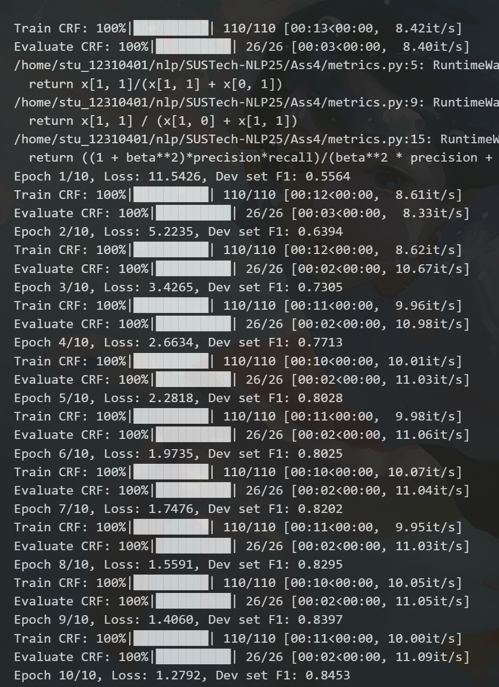
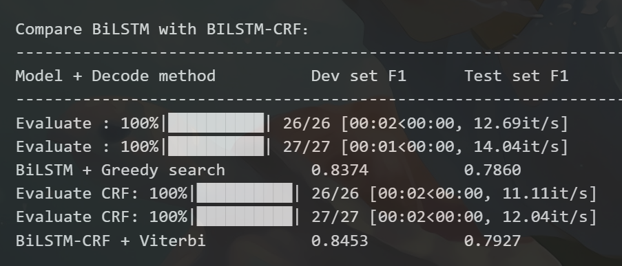

# NLP Ass4

## Name: Ziheng Wang

## SID: 12310401

## All the result can be found in the notebook, Make Sure you have download the glove datasets and unzip them.

## Step 123: Implication and F1 score of the BILSTM model

| Dataset/Epoch | F1 score |
| ------------- | -------- |
| Dev/1         | 0.6758   |
| Dev/2         | 0.6671   |
| Dev/3         | 0.7535   |
| Dev/4         | 0.7686   |
| Dev/5         | 0.7945   |
| Test/Final    | 0.7860   |

## Bonus1 Implication of MEMM

You can find my code at A4_memm.ipynb.

## Bonus2 Implication of Beam Search

You can find my code at A4_ner_beam.ipynb.

It is a little bit better than the greedy search. And the width of the beam search 3,5,10 have no significant difference on f1 score but the time cost is much longer while the width is larger.

## Bonus3 Implication of CRF

You can find my code at A4_ner_CRF_Viterbi.ipynb.

The CRF model's F1 score is lower than the previous BILSTM model at the first epoch, but it quickly surpasses the BILSTM model and achieves a higher F1 score at the end of training.

