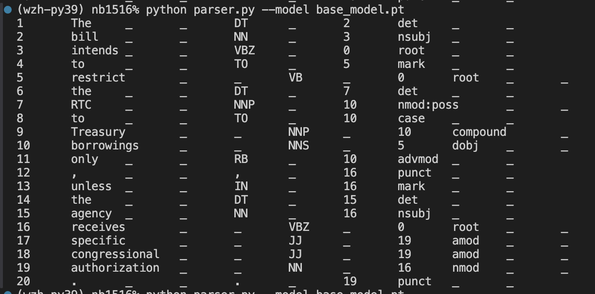

# NLP Ass5 Dependency Parsing

## Name: Ziheng Wang

## Student ID: 12310401

## Task 1-5

### Base Model

Before training the model, please check the `get_train_data.py` and ensure use the `extractor.get_input_repr_word` function in `get_training_matrices`.

Then

```bash
python get_train_data.py $DATAPATH
python train.py --model_type base
python evaluate.py --model base_model.pt
```

And the evaluate results are


It meet the requirement that UAS >=70%

### WordPos Model

Before training the model, please check the `get_train_data.py` and ensure use the `extractor.get_input_repr_wordpos` function in `get_training_matrices`.

Then

```bash
python get_train_data.py $DATAPATH
python train.py --model_type wordpos
python evaluate.py --model wordpos_model.pt
```


## Bonus Task 6

The Arc-Eager parsing algorithm is implemented in `parser_arc-eager.py`

And their different are as follows:

Arc-standard parser result:


The Arc-Eager parser result:



## Bonus Task 7

The BiLSTM model is implemented in `model.py`
and the training process is similar to the wordpos model.

```bash
python get_train_data.py $DATAPATH // same as wordpos train data
python train.py --model_type bilstm
python evaluate.py --model bilstm_model.pt
```

The evaluation result is


The UAS and LAS are higher than the wordpos model.

| Model   | dev UAS | dev LAS | test UAS | test LAS |
| ------- | ------- | ------- | -------- | -------- |
| base    | 0.789   | 0.717   | 0.790    | 0.720    |
| wordpos | 0.803   | 0.743   | 0.802    | 0.742    |
| bilstm  | 0.823   | 0.764   | 0.821    | 0.763    |
